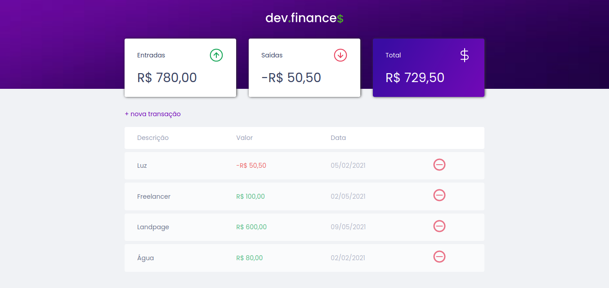

# Dev Finance

Projeto fornecido pela RocketSeat pelo professor Mayk Brito, no intuito de ensinar os fundamentos básicos ao avançados da programação. Utilizando o puro JavaScript conjunto de HTLM5/CSS3. Essa aplicação realiza a somatoria de ganhos e gastos, gerando uma tabela com o valores, seguidos de nome, valor, data. Dando a possibilidade adicionar novos valores e podendo remove-los, salvando via storage.
